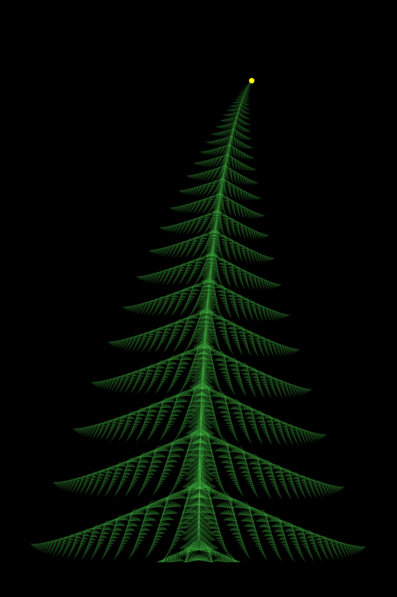

# fractal_christmas_tree
Renders Christmas tree fractal that is similar to [Barnsley fern](https://en.wikipedia.org/wiki/Barnsley_fern) fractal. The whole python code is written with less than 30 lines. Code readability may be lowered by its compactness.

Alpi Tolvanen 2020. Licence is MIT or CC0



## Running the code
**Rendering of picture takes ages!** Please consider using Numba if you do not want to wait half of an hour. This repo contains git branch "numba" which has a version of code that renders the fractal in half of a minute. "numba" is not default branch because it has few extra code lines, and it requires Numba to be installed.

## Code explanation
This fractal is based on modified version of [Barnsley fern](https://en.wikipedia.org/wiki/Barnsley_fern).

### Affine transformations
```python3
import numpy as np
from PIL import Image, ImageDraw  # Run 'pip3 install pillow'
w, h = 1280, 1920  # width, height
data = [([[ 0.1,  0.0], [ 0.0,  0.2]],  [ 0.0, 0.3]),   # trunk
        ([[ 0.1,  0.0], [ 0.0,  0.2]],  [ 0.0, 0.37]),  # trunk
        ([[ 0.87, 0.01],[-0.01, 0.87]], [ 0.0, 0.8]),   # copy branches
        ([[ 0.3, -0.3], [ 0.7, -0.2]],  [ 0.0, 0.3]),   # left branch
        ([[-0.3,  0.3], [ 0.7, -0.2]],  [-0.0, 0.3])]   # right branch
```

Variable `data` contains affine transformations that are in hearth of the fractal. Affine transformations map points of plane into another plane. Affine transormation of a point `r` is `M r + v`, where `M` is matrix, and `v` is vector.


The 5 transformations are:
1. Copy the whole tree to base of a trunk. That is, the trunk is actually just scaled down version of the tree.
2. Similar copy as above. This makes trunk a bit more dense and uniform.
3. Copy layer of branches vertically up one step. Only the lowest branches are needed, because all the rest are copied with this transformation. Branches are also scaled down a bit so that they get smaller the higher they are.
4. Copy left half of a tree to the lowest left branch. This transformation also does some skewing so that sub brances look better.
5. Copy left half of a tree to lowest right branch.

[This online tool](https://www.desmos.com/calculator/avfh60ysiv) was very useful in figuring out the correct rotation and skewing.


### Iteration

The original Barnsley fern iteration is as following:
1. Start from one point
2. Choose one transformation by random. Use specified probabilities for each transformation.
3. Apply that transformation for the point and light up a pixel in this location.
4. Repeat from 2

However, this fractal contains one modification compared to original Barnsley fern: Two points are itearated simultaneously instead of just one. Transformations 1-3 are applied identically to these two points, but transformations 4 is only applied to first point and 5 is only applied to latter. The latter point is always synchronized with first point so that tree remains symmetric.

```python3
def draw_tree(affines):
    img = np.zeros((h, w, 3), dtype=np.uint32)
    r = [np.array([0.0, 0.0]), np.array([0.0, 0.0])]
    for _ in range(w*h*10):
        idx = np.random.choice([0, 1, 2, 3], p=[0.02, 0.02, 0.76, 0.2])
        if idx == 3:
            r[1] = r[0] # Copy left branch to right side
        for j in range(2):
            (mat, vec) = affines[idx+j] if idx == 3 else affines[idx]
            r[j] = mat @ r[j] + vec  # affine transformation
            x, y = int(w * (r[j][0]/3.5 - 0.5)), int(h * (r[j][1]/7.5 + 0.05))
            img[y, x, :] += np.array([1,8,1], dtype=np.uint8)
    return img
```

The rendering time can be shortened by decreasing iterations from `w*h*10` to `ẁ*h//10` for example.

The probabilities for transformations are chosen so that points are somewhat evenly distributed. They were quite easy to find out by just trying and testing.

### Boring stuff
This part contains parts that are not important in algorithmic viewpoint.

```python3
data_numpy = list(map(lambda t: (np.array(t[0]), np.array(t[1])), data))
img = draw_tree(data_numpy)
img[...] = np.sqrt(img / img.max()) * 255
img[:h//17, :] = 0; img[-h//10:, :] = 0
fig = Image.fromarray(img[::-1, :].astype(np.uint8))
x, y = int(h*0.135), int(w*0.634)  # star
ImageDraw.Draw(fig).ellipse((y-8, x-8, y+8, x+8), fill='yellow')
fig.save('tree.png'); fig.save('tree_lossless.webp', lossless=True)
```

* Variable `data_numpy` is just `data` but expressed as numpy arrays. This hack is done only to pack code.
* Sqaure root is applied for color values to make them a bit prettier. They are also scaled on range 0-255.
* The bottom and top part of image is erased.
    * The bottom part is erased to fake base of a trunk. The base of a trunk is not actually drawn. Instead, the lowest branches are erased to make it appear that three has trunk connecting to a ground.
    * The top part is erased because this code contains invalid indexing. Some tree parts goes beyond bottom of the image appearing in the top because negative indicies wrap around in python.
* Star is drawn on top of tree.
